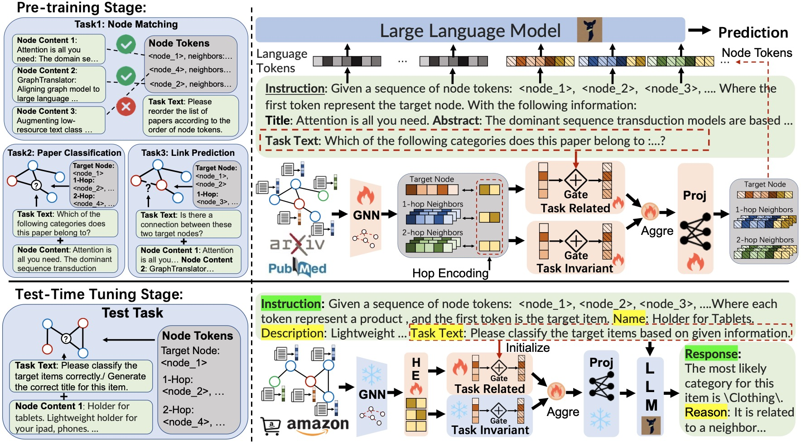

# Enable Self-supervised Fine-tuning on GFM

# <center> </center>


### 1. Environment Preparation
```shell
conda create -n graphgpt python=3.8

conda activate graphgpt

# Torch with CUDA 11.7
pip install torch==1.13.0+cu117 torchvision==0.14.0+cu117 torchaudio==0.13.0 --extra-index-url https://download.pytorch.org/whl/cu117
# To support vicuna base model
pip3 install "fschat[model_worker,webui]"
# To install pyg and pyg-relevant packages
pip install torch_geometric
pip install pyg_lib torch_scatter torch_sparse torch_cluster torch_spline_conv -f https://data.pyg.org/whl/torch-1.13.0+cu117.html
# Clone our GraphGPT
git clone https://github.com/HKUDS/GraphGPT.git
cd GraphGPT
# Install required libraries
pip install -r requirements.txt
```
### 2. Prepare Models and data
Prepare base model Vicuna, please download its weights [here](https://github.com/lm-sys/FastChat#model-weights).
Prepare pre-training data follow GraphGPT/data from https://github.com/HKUDS/GraphGPT.
Prepare test-time tuning data follow our code presented in data/cora/reshape_cora.py.
### 3. Pre-training Stage
```shell
cd path/to/grapht3
sh ./scripts/tune_script/stage1.sh
sh ./scripts/tune_script/stage2.sh
```
### 4. Test-time tuning Stage
```shell
cd path/to/grapht3
sh ./scripts/tune_script/SFTonGFM_train.sh
```

### 5. Evaluate
```shell
cd path/to/grapht3
sh ./scripts/tune_script/SFTonGFM_eval.sh
```

### 6. Note
Our code is based on the GraphGPT framework https://github.com/HKUDS/GraphGPT, we thank them for their excellent work.